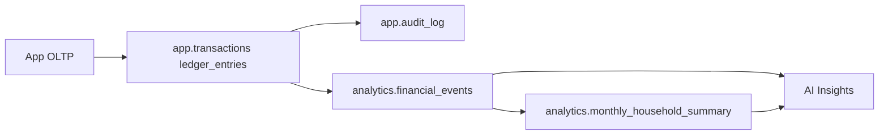

# Preparación para AI Insights

Aplicación web privada de finanzas personales + familiares. Ledger inmutable. Este documento define la arquitectura para análisis y AI sin tocar la contabilidad operativa.

---

## 1. Arquitectura recomendada

- **OLTP**: esquema `app` (transactions, ledger_entries, accounts, audit_log). Única fuente de verdad; inmutabilidad y balance contable garantizados por triggers.
- **Analytics**: esquema `analytics`. Solo lectura; derivado de `app` mediante vistas/vistas materializadas. La AI y los reportes leen únicamente de aquí.
- **Flujo**: transacciones se insertan en `app` → triggers y auditoría se ejecutan → vistas `analytics.*` reflejan datos actuales (o con refresco programado en el caso de materializadas).

---

## 2. Tablas/vistas para AI

| Objeto | Uso | Actualización |
|--------|-----|----------------|
| `analytics.financial_events` | Vista; cada movimiento con household, fecha, cuenta, categoría, monto firmado. Input para patrones, anomalías, proyección. | Tiempo real (vista sobre app). |
| `analytics.monthly_household_summary` | Vista materializada; agregado mensual por household (ingresos/gastos/conteo). | Refresco periódico (cron o job): `REFRESH MATERIALIZED VIEW analytics.monthly_household_summary;` |

---

## 3. Campos clave para AI

- **household_id**, **occurred_at**: contexto y tiempo.
- **account_id**, **account_name**, **account_type**, **is_personal**, **owner_user_id**: origen del movimiento, personal vs familiar.
- **category**, **direction**, **amount_minor**, **signed_amount_minor**: clasificación y magnitud.
- **transaction_id**, **description**: trazabilidad y contexto semántico.

Para patrones de gasto y anomalías: usar **signed_amount_minor**, **category**, **occurred_at**, **household_id**. Para proyección: usar agregados mensuales (p. ej. `monthly_household_summary`) o agregar por período sobre `financial_events`.

---

## 4. Riesgos de usar AI sobre ledger crudo

- **Consultas pesadas** sobre `app.transactions` y `app.ledger_entries` pueden afectar latencia OLTP; por eso se exponen vistas/agregados en `analytics`.
- **Interpretación errónea** de débitos/créditos puede llevar a métricas incorrectas; usar siempre `signed_amount_minor` o vistas que ya expongan signo correcto.
- **Filtrado por household**: la AI debe restringir siempre por `household_id` (y por usuario si aplica) para no mezclar datos entre familias.
- **No escribir nunca** en `app.transactions` ni `app.ledger_entries` desde procesos de AI; las correcciones son solo mediante asientos reversos creados por la aplicación.

---

## 5. Qué NO debe tocar nunca la AI

- **INSERT/UPDATE/DELETE** en `app.transactions`, `app.ledger_entries`, `app.accounts`, `app.audit_log`.
- **Modificación** de saldos o asientos existentes; las correcciones son siempre una nueva transacción (reverso).
- **Bypass** de validaciones de balance (débitos = créditos) o de inmutabilidad.
- **Acceso** a datos de otro household sin autorización; siempre filtrar por `household_id` (y RLS).
- **Uso de `app` como única fuente de agregados pesados**; usar `analytics` para reportes y modelos.

---

## 6. Checklist accionable

- [ ] Todos los modelos/insights leen solo de `analytics.*` (o de APIs que a su vez lean de analytics).
- [ ] Refresco de `analytics.monthly_household_summary` programado (p. ej. diario o tras cargas masivas).
- [ ] Documentar qué features de AI están habilitados (patrones, anomalías, proyección) y con qué datos se alimentan.
- [ ] Revisar que ningún job de AI tenga credenciales con permisos de escritura sobre `app` más allá de las que use la app para crear reversos.

---

## 7. Advertencias críticas

- **Integridad contable**: la única fuente de verdad es el ledger en `app`. Cualquier discrepancia entre analytics y app debe resolverse ajustando analytics o los procesos que los alimentan, nunca modificando el ledger histórico.
- **Privacidad**: los datos en `analytics` siguen siendo personales/familiares; aplicar las mismas políticas de acceso y retención que para el resto de la aplicación.
- **Reversos**: si la AI sugiere “correcciones”, estas deben implementarse como nuevas transacciones creadas por la aplicación (usuario o proceso autorizado), nunca como updates directos al ledger.
